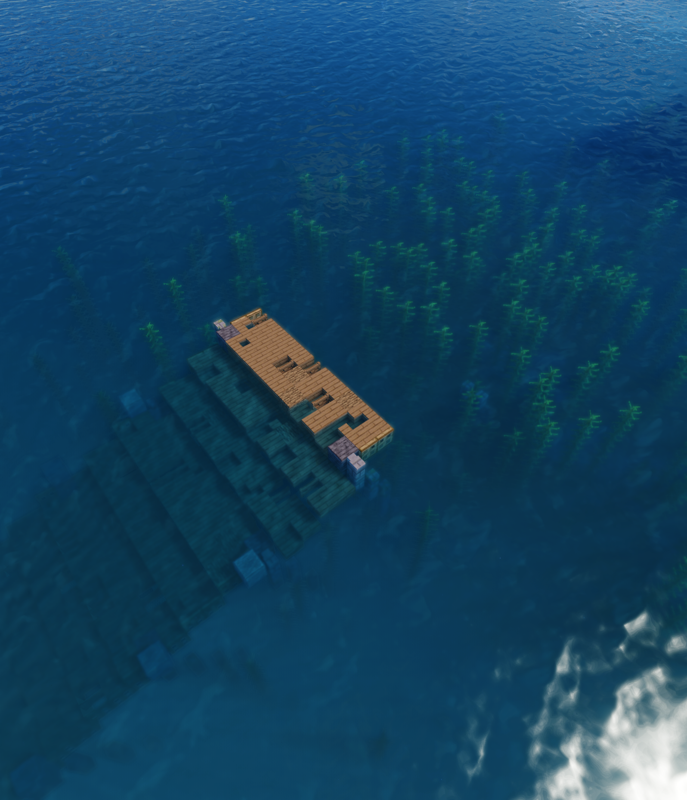

# Oceano Shaders

**A Realistic Vibrant Shaderpack for Minecraft Java Edition**

A complete rewrite of the original Oceano Shaders, now with modern rendering techniques and improved performance.

## About

Oceano Shaders has been downloaded by over 1.6 million players since 2019. This is a ground-up rewrite bringing modern shader techniques while retaining the unique aesthetic that made the original so popular.

## What's New in This Version

- Complete codebase rewrite for better performance and maintainability
- Temporal Anti-Aliasing (TAA) for smooth, artifact-free visuals
- PCSS soft shadows with realistic penumbra
- Volumetric clouds, fog, and light shafts
- Self-Shadowed Parallax Occlusion Mapping for terrain depth
- PBR material support with reflections and emission

## Features

### Water Rendering
- **Parallax Water Displacement** - Creates depth and wave height for realistic water surfaces
- **Dynamic Reflections** - Fresnel-based sky reflections that respond to viewing angle
- **Refraction** - Realistic refraction on water surfaces based on real-life measurements

### Lighting & Shadows
- **PBR Materials** - Physically-based rendering with roughness, metallic, and emission support
- **PCSS Soft Shadows** - Percentage-closer soft shadows with realistic penumbra
- **Fake Colored Bounce Lighting** - A unique system to emulate the same effects given by Global Illumination or Ray Tracing with zero performance cost

### Atmospheric Effects
- **Volumetric Cloud fog** - Raymarched fog with adjustable density and height falloff
- **Light Shafts** - God rays streaming through trees and terrain
- **Realistic Atmosphere** - A dynamic sky box to retain high quality without a performance loss

### Post-Processing
- **Temporal Anti-Aliasing** - Smooth edges with motion-aware reprojection
- **Ambient Occlusion** - Contact shadows in corners and crevices
- **Parallax Occlusion Mapping** - Deep terrain textures without extra geometry, with self-shadowing
- **AgX ToneMapping** - Same standard used by programs such as Blender, DaVinci Resolve, Toolbag, Octane, Godot, and Three.js

## Installation

1. Install [Iris Shaders](https://irisshaders.dev/) or [OptiFine](https://optifine.net/)
2. Download the latest release from [Releases](../../releases)
3. Place the `.zip` in your `.minecraft/shaderpacks` folder (`.minecraft/shaderpacks/Oceano_Rewrite/shaders/...`)
4. Select Oceano Shaders in Options -> Video Settings -> Shaders

## Performance

Oceano is designed to run well on all modern hardware while still looking great. 
It is possible to use a mobile GPU at 4k and retain 60fps.

## Requirements

- Minecraft 1.16+
- Iris 1.6+ or OptiFine
- OpenGL 3.2+ compatible GPU
- 4GB+ VRAM recommended for high settings

## Community

Join the [ShaderLabs Discord](https://discord.gg/shaderLabs) for support and unreleased dev updates.

## Credits

- **Original Oceano Shaders** - Leo Petersen (2019-2021)
- **Rewrite** - Leo Petersen (2025)

## License

MIT License - feel free to use and modify with attribution.
